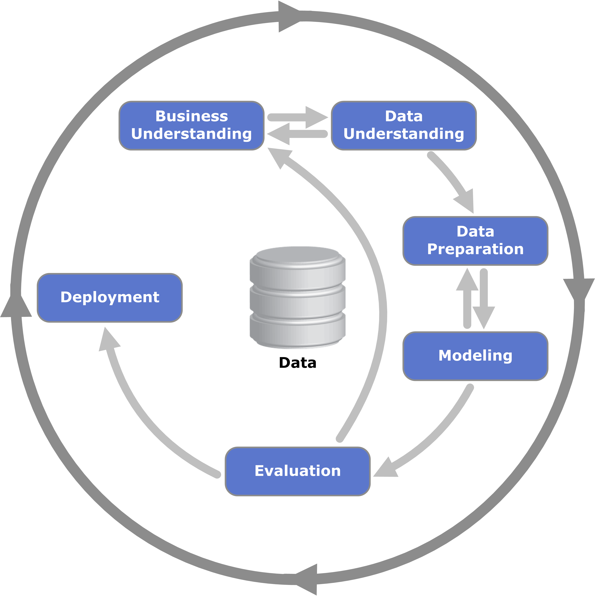

## 📊 CRISP-DM: A Framework for ML Projects

In this lesson we explored **CRISP-DM** (Cross-Industry Standard Process for Data Mining), a methodology that provides structure to machine learning projects. Despite being introduced in the 1990s, it remains highly relevant today, as it enforces clarity, iteration, and alignment between business goals and ML solutions.

  

<em>Source: <a href="https://en.wikipedia.org/wiki/Cross-industry_standard_process_for_data_mining" target="_blank">CRISP-DM</a></em>

### 🔹 The Six Steps of CRISP-DM
1. **Business Understanding**  
   - Define the problem and establish clear, measurable goals (KPIs).  
   - Question if ML is the right solution or if a simpler rule-based system suffices.  
   - Example: In spam detection, the goal could be “reduce spam complaints by 50%.”

2. **Data Understanding**  
   - Assess data availability, reliability, and quality.  
   - Identify potential gaps, biases, or insufficient volume.  
   - Example: Validate whether “Spam” button feedback is reliable enough to train a model.

3. **Data Preparation**  
   - Clean and transform raw data into a format suitable for ML models.  
   - Build data pipelines for consistent preprocessing and feature extraction.  
   - Example: Convert emails into tabular format with features like sender, subject, and presence of specific keywords.

4. **Modeling**  
   - Train and experiment with multiple ML algorithms (e.g., Logistic Regression, Decision Trees, Neural Networks).  
   - Iterate between data preparation and modeling when needed.  
   - Objective: Select the model that best balances performance and complexity.

5. **Evaluation**  
   - Measure model performance against business goals.  
   - Ask: *Did we achieve the defined KPI?*  
   - Example: If the goal was 50% spam reduction, is the model achieving it? If not, revisit earlier steps.

6. **Deployment**  
   - Roll out the model to production, starting with a small set of users before full rollout.  
   - Ensure monitoring, maintainability, and scalability.  
   - Modern practice: Deployment itself often serves as live evaluation.

### 🔄 Iterative Nature
- CRISP-DM is **not linear** — teams cycle back when new insights emerge.  
- Best practice: **Start simple**, deploy, gather feedback, and improve through fast iterations.  

### 💡 Key Takeaways
- ML projects succeed when business objectives drive technical work.  
- Data quality and problem framing are as important as model accuracy.  
- Deployment isn’t the end! Continuous monitoring and iteration are essential.
