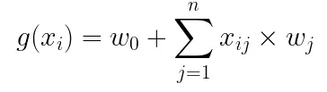
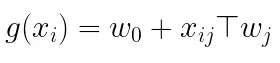
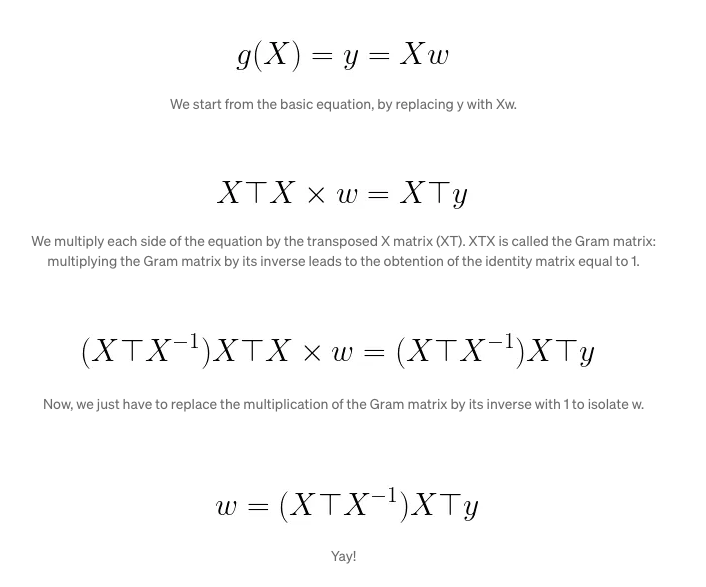
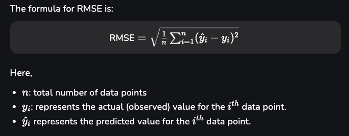

# 📈 Module 2 — Regression Fundamentals

This module focuses on **Regression**, one of the most fundamental techniques in Machine Learning.  
It explores the mathematical foundations, model interpretation, evaluation metrics, and practical implementation using a **Car Price Prediction** project.

## 🧠 Learning Objectives
- Understand the **concept of regression** and how it models relationships between variables.  
- Derive the **mathematical formulation of Linear Regression** using matrix algebra.  
- Learn the **Ordinary Least Squares (OLS)** solution and its geometric intuition.  
- Implement regression in Python using **NumPy**, **Pandas**, and **Scikit-Learn**.  
- Evaluate model performance using **RMSE (Root Mean Squared Error)** and other metrics.

## 📚 Contents

### 1. Conceptual Overview
Regression aims to find the best-fitting line (or hyperplane) through data points by minimizing the difference between **predicted** and **observed** values.

  

Key equation for a simple linear regression: Y = theta_1 + theta_2 X 

- theta_1: Intercept  
- theta_2: Slope (rate of change)  

### 2. Mathematical Formulation

In vectorized form for multiple features:

  

We can express this compactly as:

  

The **Normal Equation** solution:

  

### 3. Model Evaluation — RMSE

To assess model accuracy, we use the **Root Mean Squared Error (RMSE)**:

  

- Lower RMSE → better fit.

## 🚗 Project: Car Price Prediction

Notebook: [car-price-prediction.ipynb](./car-price-prediction.ipynb)

**Goal:** Predict car prices using features like engine size, horsepower, and curb weight.

### Steps:
1. **Data preprocessing**  
   - Handle missing values  
   - Normalize numerical features  
   - Encode categorical variables  

2. **Feature selection & model training**  
   - Split data into train/test sets  
   - Train Linear Regression model (OLS)  

3. **Evaluation**  
   - Compute RMSE
   - Visualize predicted vs actual prices  

4. **Interpretation**  
   - Identify which features influence car prices the most  
   - Visualize regression line fit and residual distribution  

## 🧮 Related Notebooks
- [car-price-prediction.ipynb](./car-price-prediction.ipynb) — Main project  
- [homework.ipynb](./homework.ipynb) — Exercises and hands-on regression tasks  

## 🎯 Key Takeaways
- Linear regression seeks weights for the regression funtion that minimize the **sum of squared errors** between predictions and actual outcomes.  
- The **Normal Equation** provides a closed-form solution without iterative optimization.  
- **RMSE** measures prediction accuracy in the same units as the target variable.  
- Regression forms the **foundation for more advanced ML methods** 