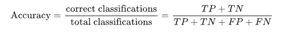
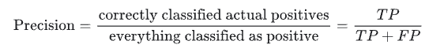
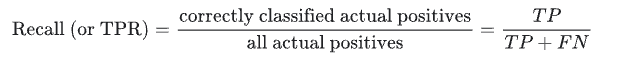
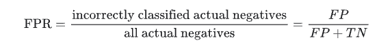
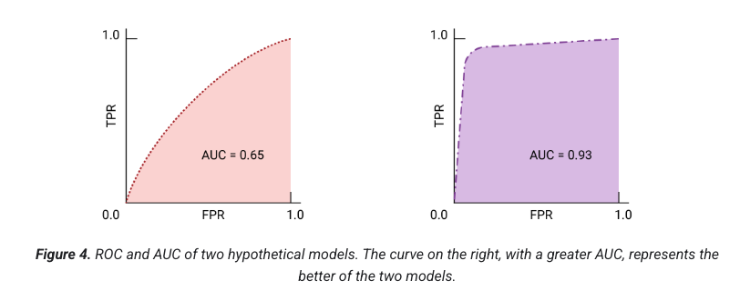

# 📊 Module 4 — Evaluation Metrics for Classification

This module explores **how to measure the performance of classification models**, focusing on understanding the strengths, weaknesses, and trade-offs between various evaluation metrics. It builds on the previous churn prediction model, introducing key concepts like **thresholds**, **confusion matrix**, **precision**, **recall**, **ROC curves**, **AUC**, and **cross-validation** to assess how reliable and generalizable a model truly is.

---

## 🎯 Learning Objectives
- Understand the purpose of **evaluation metrics** in classification tasks  
- Learn how to interpret the **confusion matrix** and derive key performance measures  
- Explore **accuracy**, **precision**, **recall**, and **false positive rate** and when to use each  
- Visualize model performance using **ROC curves** and **AUC**  
- Apply **cross-validation** to estimate model generalization and stability  

---

## 🧠 Theoretical Overview

### 1️⃣ Classification Thresholds  
Every classifier outputs probabilities, not just class labels.  
A **threshold** determines when a sample is classified as positive or negative.  
- Increasing the threshold → fewer positive predictions (lower recall, higher precision).  
- Decreasing the threshold → more positive predictions (higher recall, lower precision).  
Choosing an appropriate threshold depends on the business trade-off between **false positives** and **false negatives**.

---

### 2️⃣ Confusion Matrix  
The **confusion matrix** summarizes the outcomes of a classification model by comparing predictions to actual results:  

|                | **Actual Positive** | **Actual Negative** |
|----------------|---------------------|---------------------|
| **Predicted Positive** | True Positive (TP) | False Positive (FP) |
| **Predicted Negative** | False Negative (FN) | True Negative (TN) |

It forms the basis for all other metrics — allowing us to evaluate different types of model errors.

---

### 3️⃣ Core Metrics  
- **Accuracy:**  
  Measures the proportion of correct predictions.  
  Works well only when classes are balanced.  

- **Precision:**  
  Of all predicted positives, how many were actually positive.  
  Important when false positives are costly.

- **Recall (Sensitivity or True Positive Rate):**  
  Of all actual positives, how many did the model correctly identify.  
  Important when false negatives are costly.

- **False Positive Rate (FPR):**  
  The proportion of actual negatives incorrectly predicted as positives.

Precision and Recall usually **trade off** with each other — increasing one tends to decrease the other, which makes balancing them essential depending on context.

---

### 4️⃣ ROC Curve and AUC  
The **ROC curve** plots **True Positive Rate (Recall)** against **False Positive Rate** at every possible threshold.  
It shows the model’s ability to distinguish between classes across all thresholds.  

- A **perfect model** reaches the top-left corner (TPR=1, FPR=0).  
- A **random model** lies on the diagonal (AUC ≈ 0.5).  
- The **Area Under the Curve (AUC)** measures the overall discriminative power — higher AUC indicates a better model.  

ROC-AUC is particularly useful when comparing different classifiers or tuning thresholds.

---

### 5️⃣ Cross-Validation  
**Cross-validation (CV)** provides a more robust estimate of model performance.  
Instead of relying on a single train/test split, CV divides the data into multiple **folds**, repeatedly training and testing across them.  

- **K-Fold CV:** splits the data into *k* folds (typically 5 or 10).  
- **Stratified K-Fold:** preserves class proportions across folds — recommended for imbalanced data.  
- Reports the **mean ± standard deviation** of the chosen metric (e.g., ROC-AUC), showing both performance and stability.  

CV helps ensure that the model’s results are not just a product of a lucky or unlucky split.

---

## 💡 Key Takeaways
- Evaluation metrics reveal **how** and **where** a model performs well or fails — accuracy alone is not enough.  
- **Precision** and **Recall** represent opposing priorities and must be balanced according to business context.  
- **ROC-AUC** provides an aggregate view of model discrimination across thresholds.  
- **Cross-validation** offers a reliable way to assess generalization and avoid overfitting.  
- The optimal metric and threshold depend on the **real-world cost** of misclassification.

---
