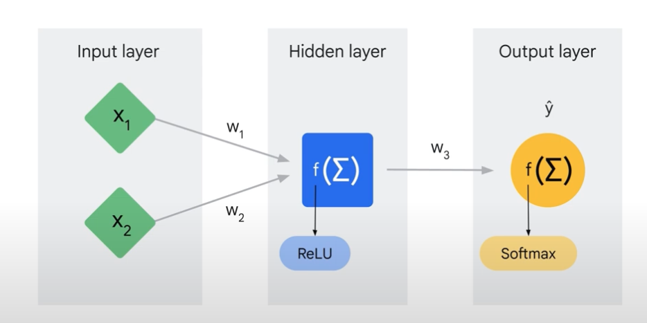
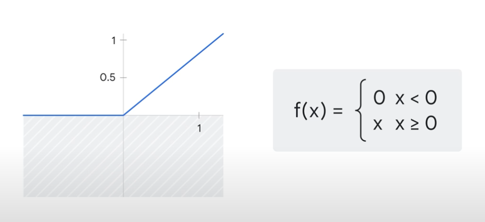
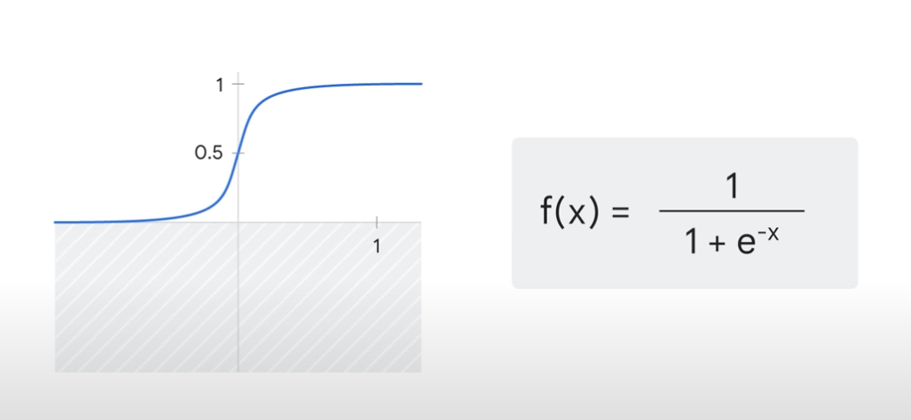
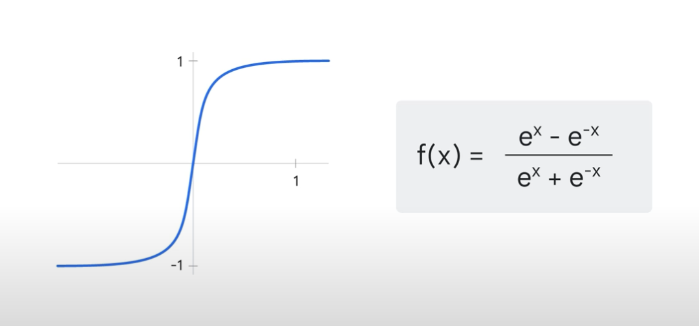
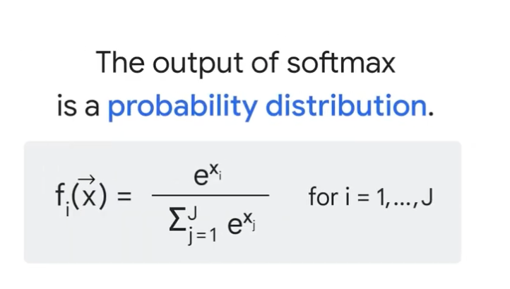
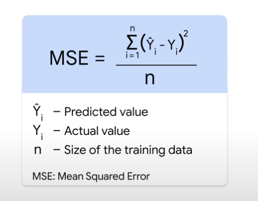
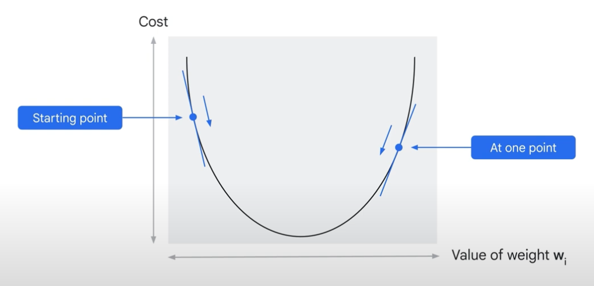

# 📘 How a Machine Learns  

## 🎯 Learning Objectives  
- Understand how a **neural network** (ANN) learns from data end-to-end.  
- Learn the roles of **activation functions**, **loss/cost functions**, **backpropagation**, and **gradient descent**.  
- Distinguish **parameters** (learned) vs **hyperparameters** (set by you).  
- Grasp key training notions: **learning rate**, **epochs**, and the **iteration loop**.  

---

## 📝 Summary  

Modern models (DNNs, CNNs, RNNs, LLMs) all build on the **artificial neural network (ANN)**:  
- **Layers:** input → hidden → output  
- **Neurons:** connected by **weights** (and **biases**), which are learned in training  
- Example task: given article titles, predict the **source** (e.g., GitHub, NYT, TechCrunch)

At a high level, a forward pass computes a prediction y'. We then measure how far y' is from the true label y, and **adjust the weights** to reduce that difference. This loop repeats until the model converges (or a budget is met).

---

## 🔢 Forward Pass (Prediction)  

1. **Weighted sums:** multiply inputs by weights and sum (bias often included).  
2. **Activation functions:** add **non-linearity** so deeper networks can model complex patterns.  
3. **Output layer:** applies an activation suited to the task, producing y'.

### Common Activation Functions  
- **ReLU:** fast and effective for hidden layers.  

- **Sigmoid:** used for **binary** classification outputs.  

- **Tanh:** zero-centered alternative to sigmoid.  

- **Softmax:** converts logits to a **probability distribution** over **multiple classes** (multiclass classification).  

> Without activations, stacked linear layers collapse to a single linear transform — **no extra expressiveness**.

---

## 📉 Measuring Error (Loss Function)  

Typical choices:  
- **Regression:** **MSE** 

- **Classification:** **Cross-Entropy** (compares predicted vs. true probability distributions)

Lower loss ⇒ better predictions.

---

## 🔁 Backpropagation & Gradient Descent  

Once loss is computed:  
1. **Backpropagation** computes **gradients** of the loss w.r.t. each weight/bias via the chain rule.  
2. **Gradient Descent** updates parameters **opposite** the gradient to descend the loss surface.

Two key questions:  
- **Direction?** Use the **sign** of the derivative/gradient (left vs. right on the curve).  
- **Step size?** Set by the **learning rate** (a **hyperparameter**).  
  - Too small ⇒ very slow.  
  - Too large ⇒ overshooting/divergence.  
  - “Just right” ⇒ stable, fast convergence.

### Epochs & Iteration  
- **Epoch:** one full pass over the training data (forward + backward).  
- Train for multiple epochs until the loss plateaus (or early stopping triggers).

---

## ⚙️ Parameters vs. Hyperparameters  

- **Parameters (learned by the model):**  
  - **Weights** and **biases** — updated via backpropagation/gradient descent.  
- **Hyperparameters (set by you before training):**  
  - **Architecture:** number of layers/neurons  
  - **Activations** per layer  
  - **Learning rate**, **batch size**, **epochs**  
  - Regularization, optimizer choice, etc.

> Tools like **AutoML** can **auto-select** many hyperparameters to reduce manual experimentation.

---

## 💡 Key Insights  
- **Activation functions** give neural nets the power to learn non-linear relationships.  
- **Loss + Backprop + Gradient Descent** = the core learning loop.  
- **Learning rate** and **epochs** strongly influence convergence and final performance.  
- **Sigmoid vs. Softmax:** binary vs. multiclass outputs.  
- The **fundamental learning process** is the same from a tiny ANN to very large LLMs.

---

## 📚 References  
- [Activation Functions (Concepts)](https://developers.google.com/machine-learning/crash-course/neural-networks/activation-functions)  
- [Loss & Optimization (Gradient Descent)](https://developers.google.com/machine-learning/crash-course/reducing-loss/gradient-descent)  