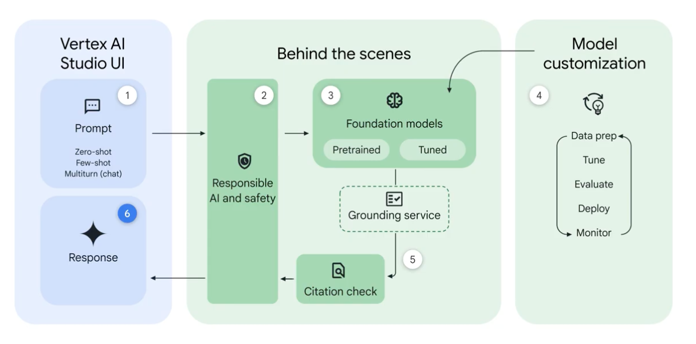

# 📘 Introduction to Generative AI on Google Cloud  

## 🎯 Learning Objectives  
- Understand what **Generative AI (Gen AI)** is and how it works.  
- Learn about **foundation models** and how they are **pre-trained** and **fine-tuned**.  
- Identify Google’s key **Gen AI foundation models** (Gemini, Gemma, Codey, Imagen).  
- Explore the **Generative AI workflow** on Google Cloud using **Vertex AI Studio** and **Model Garden**.  

---

## 📝 Summary  

**Generative AI (Gen AI)** is a branch of artificial intelligence focused on **creating new content** — text, code, images, audio, video, and even 3D — based on a **prompt**. It is revolutionizing how people **interact with technology** and automating creative, analytical, and operational tasks.  

Imagine:  
- A **marketing manager** generating campaign content in minutes.  
- A **data scientist** asking AI to write SQL queries.  
- An **app developer** building a healthcare chatbot with natural conversation.  

Generative AI enables all of these by using powerful **foundation models** trained on massive datasets.  

---

## ⚙️ How Generative AI Works  

1. **Training on Massive Datasets**  
   - The model learns from vast amounts of existing text, images, audio, and videos.  
   - The output is a **foundation model** — a large AI model capable of understanding and generating content.  

2. **Foundation Models**  
   - Large in parameter count, training data, and computational scale.  
   - Serve as the base for both **general-purpose** and **specialized** AI systems.  

3. **Pre-training and Fine-tuning**  
   - **Pre-training:** Learn general language, image, or multimodal patterns using large public datasets.  
   - **Fine-tuning:** Refine the model on smaller, domain-specific datasets to specialize it.  

   > 🐶 *Analogy:* Like training a dog general commands (“sit,” “stay”), then giving additional training to become a guide or police dog.  

   - Example:  
     - Pre-trained model → general-purpose text understanding (question answering, summarization).  
     - Fine-tuned model → financial document analysis, healthcare chatbot, retail recommendation engine.  

---

## 🤖 Google’s Foundation Models  

| **Model** | **Purpose** | **Description** |
|------------|--------------|----------------|
| **Gemini** | Multimodal | Handles text, images, video, and code — represents the future of AGI (Artificial General Intelligence). |
| **Gemma** | Lightweight LLM | Open model optimized for text generation and efficiency. |
| **Codey** | Code Generation | Generates, completes, and chats about code. |
| **Imagen** | Image Generation | Creates and interprets images and captions. |

> ⚠️ These models evolve continuously — Gemini may eventually unify several of these capabilities.  

---

## 🔁 Generative AI Workflow on Google Cloud  

Google Cloud offers an **end-to-end development environment** for Gen AI via **Vertex AI**, integrating responsible AI and customization features.  

1. **Prompt Input:**  
   - Enter natural language prompts via **Vertex AI Studio UI**.  

2. **Responsible AI & Safety Checks:**  
   - Prompts undergo configurable checks for fairness, safety, and compliance.  

3. **Foundation Models:**  
   - The prompt is routed to the selected Gen AI model (e.g., Gemini, Imagen, Codey).  

4. **Model Customization (Optional):**  
   - Fine-tune or adapt models with your own data for domain-specific accuracy.  

5. **Results Grounding:**  
   - AI outputs are validated through **grounding** and **citation checks** to minimize hallucinations and enhance factuality.  

6. **Final Response:**  
   - The validated output appears in **Vertex AI Studio**, ready for review or deployment.  

---

## 🧰 Tools for Generative AI on Google Cloud  

- **Vertex AI Studio:**  
  - The primary interface for testing, prompting, and customizing foundation models.  
  - Supports multimodal prompts and real-time interactions.  

- **Model Garden:**  
  - Repository of Google and third-party pre-trained and fine-tuned Gen AI models.  
  - Lets users discover, deploy, and adapt models for enterprise use.  

---

## 💡 Key Insights  
- **Generative AI** produces multimodal content — transforming creativity, coding, and data workflows.  
- **Foundation Models** are the engines behind Gen AI — trained on massive datasets, then fine-tuned for specialization.  
- **Google’s Gen AI stack (Gemini, Gemma, Codey, Imagen)** powers everything from text to video.  
- **Vertex AI Studio + Model Garden** provide an integrated environment for experimentation, customization, and responsible AI usage.  
- Responsible AI and grounding checks ensure safe, accurate, and transparent output.  

---

## 📚 References  
- [Vertex AI Studio](https://cloud.google.com/vertex-ai/generative-ai/docs/overview)  
- [Model Garden](https://cloud.google.com/model-garden)  
- [Gemini Models Overview](https://deepmind.google/technologies/gemini/)  
- [Responsible AI at Google](https://ai.google/responsibilities/responsible-ai-practices/)  
