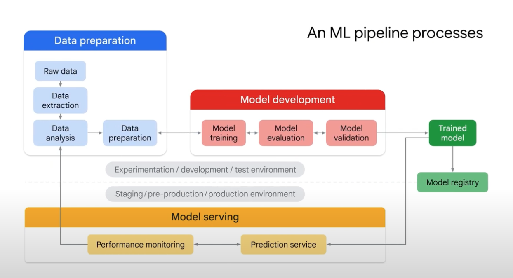

# 📘 MLOps and Workflow Automation on Google Cloud  

## 🎯 Learning Objectives  
- Understand what **MLOps** is and how it applies DevOps principles to machine learning.  
- Learn how **Vertex AI Pipelines** automates, monitors, and manages the ML lifecycle.  
- Explore the use of **Kubeflow Pipelines (KFP)** and **TensorFlow Extended (TFX)** for building pipelines.  
- Recognize the different **phases of ML automation** (manual → partial → full CI/CT/CD).  
- Identify key **pipeline components** and how to assemble them into automated workflows.  

---

## 📝 Summary  

**MLOps (Machine Learning Operations)** is the practice of combining **machine learning development** with **operations** to build, deploy, and manage models reliably at scale.  

Just as **DevOps** focuses on continuous integration and delivery for software,  
**MLOps** enables **continuous integration (CI)**, **continuous training (CT)**, and **continuous delivery (CD)** for ML models.  

The goal of MLOps is to:  
- Automate and monitor every stage of the ML workflow.  
- Build reproducible, production-ready ML systems.  
- Ensure scalability, reliability, and governance for deployed models.  

---

## ⚙️ MLOps on Vertex AI  

The **backbone of MLOps** on Google Cloud is **Vertex AI Pipelines**, a toolkit that automates and orchestrates ML workflows in a **serverless** environment.  

### 🔹 Supported Frameworks  
- **Kubeflow Pipelines (KFP):** General-purpose, open-source pipeline framework.  
- **TensorFlow Extended (TFX):** Designed for TensorFlow-based ML workflows.  
  - Ideal for processing terabytes of structured data and transforming TensorFlow models into production pipelines.  

> Use **TFX** when working with TensorFlow-based models.  
> Use **KFP** for other frameworks or hybrid workflows.  

---

## 🧩 Structure of an ML Pipeline  

An **ML pipeline** is a collection of **components** — each one performing a specific task in the workflow.  

  

### Environments  
1. **Development Environment:**  
   - Data extraction, preparation, and model training/evaluation.  
   - Outputs a trained model to the **Model Registry**.  
2. **Staging/Production Environment:**  
   - Model deployment and monitoring.  
   - Supports CI/CD/CT automation.  

### Components  
Each component is like a **function** or building block within a workflow.  
- Perform one self-contained task (e.g., training, validation, deployment).  
- Can be **custom-built** or **pre-built** by Google Cloud.  

**Examples of Pre-built Components:**  
- `TabularDatasetCreateOp` → Creates a dataset in Vertex AI from Cloud Storage or BigQuery.  
- `AutoMLTabularTrainingJobRunOp` → Launches an AutoML training job.  
- `EndpointCreateOp` → Creates an endpoint in Vertex AI.  
- `ModelDeployOp` → Deploys a trained model to an endpoint.  

**Custom Components Example:**  
- `classification_model_eval_metrics` → Compares model evaluation metrics (e.g., accuracy, precision) to a predefined threshold.  
  - If performance meets the threshold → deploy.  
  - Otherwise → retrain automatically.  

---

## 🔁 Phases of ML Automation  

| **Phase** | **Description** | **Tools / Example** |
|------------|----------------|--------------------|
| **Phase 0 – Manual Workflow** | GUI-based approach using AutoML for manual training, deployment, and serving. | Vertex AI Console |
| **Phase 1 – Component Automation** | Begin automating individual components using Vertex AI Pipelines SDK. | Training pipelines, data ingestion components |
| **Phase 2 – Full Workflow Automation** | Integrate all components for CI/CT/CD automation and continuous retraining. | End-to-end Vertex AI Pipelines |

---

## 🧠 Example: Automated Bean Classification Pipeline  

1. **Build the Pipeline:**  
   - Define components (pre-built + custom).  
   - Ensure each component has a **single responsibility** (training, evaluation, deployment).  

2. **Add Custom Component:**  
   - `classification_model_eval_metrics` checks model quality before deployment.  

3. **Assemble the Pipeline:**  
   - Combine components:  
     - `TabularDatasetCreateOp`  
     - `AutoMLTabularTrainingJobRunOp`  
     - `classification_model_eval_metrics`  
     - `EndpointCreateOp`  
     - `ModelDeployOp`  

4. **Compile and Run:**  
   - Compile with `compiler.compile()` and execute using a pipeline job.  
   - The pipeline trains, evaluates, and deploys automatically.  

> ✅ Once configured, the pipeline continuously monitors model performance and triggers retraining or redeployment as needed — **hands-free ML automation**.

---

## 🧩 Vertex AI Pipeline Templates  

Google Cloud provides pre-built templates to accelerate development:  
- **AutoML Tabular Classification/Regression**  
- **TensorFlow Training and Serving Pipelines**  

These templates can be customized to fit your business goals and dataset requirements.  

---

## 💡 Key Insights  
- **MLOps** is essential for production-grade ML — enabling automation, reproducibility, and continuous improvement.  
- **Vertex AI Pipelines** unify MLOps automation across tools, frameworks, and environments.  
- Using **pre-built and custom components** together accelerates development while maintaining flexibility.  
- MLOps enables enterprises to evolve from manual ML workflows to **fully automated, intelligent systems**.  

---

## 📚 References  
- [Vertex AI Pipelines](https://cloud.google.com/vertex-ai/docs/pipelines)  
- [Kubeflow Pipelines](https://www.kubeflow.org/docs/components/pipelines/)  
- [TensorFlow Extended (TFX)](https://www.tensorflow.org/tfx)  
- [MLOps on Google Cloud](https://cloud.google.com/architecture/mlops-continuous-delivery-and-automation-pipelines-in-machine-learning)  
