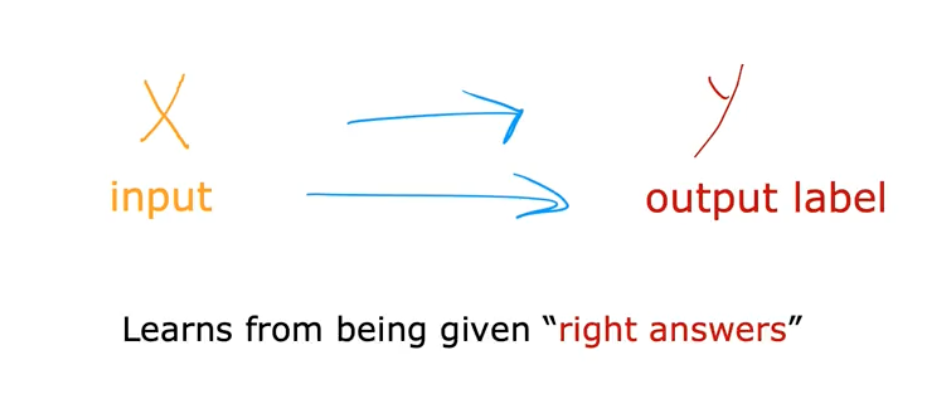
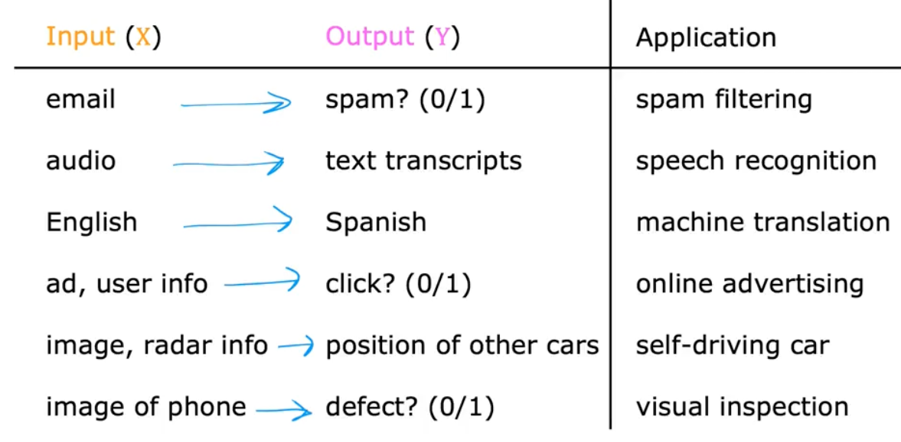
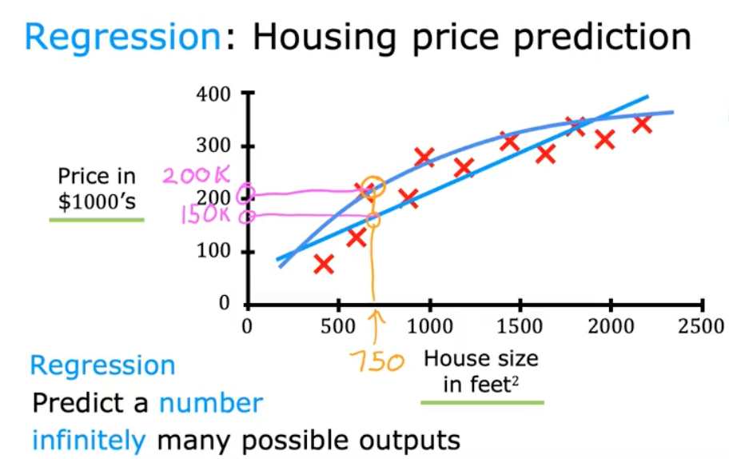
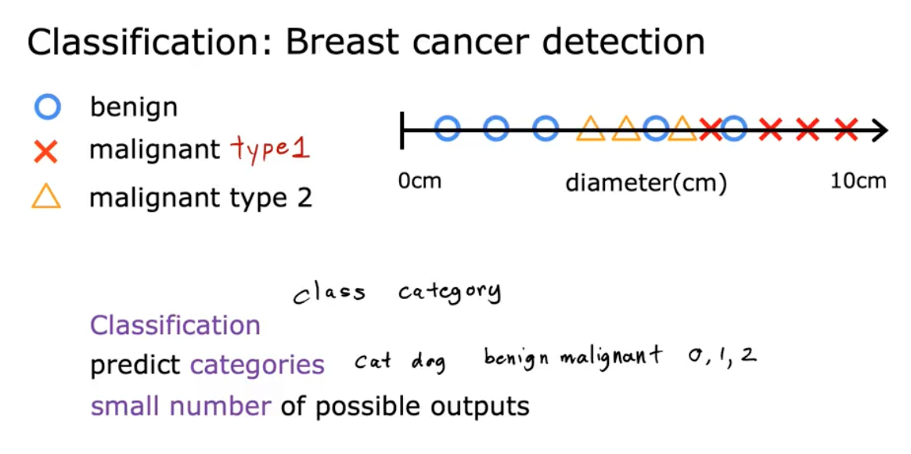
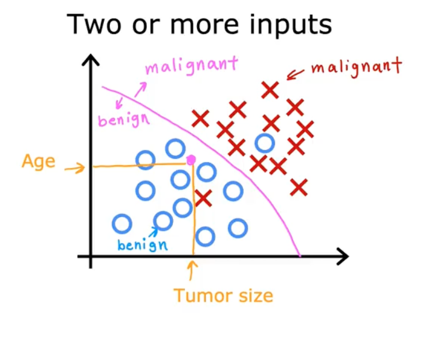

# 📘 Supervised Learning

## 🎯 Learning Objectives

- Understand what supervised learning is and how it maps inputs (X) to outputs (Y).

- Learn the difference between the two main supervised learning tasks:

    -  Regression → predicting numbers

    - Classification → predicting categories

- Learn how supervised learning can use one input or multiple input features.

## 📝 Summary

### 🔍 What Is Supervised Learning?

Supervised learning is a type of machine learning in which the algorithm learns how to map **inputs (X)** to **outputs (Y)** using examples that include the correct answers.

After learning this mapping, the model can take a new, unseen input X and predict Y with good accuracy.

This paradigm accounts for ~99% of the economic value created by ML today.

A supervised learning problem always gives the model:

**Input X:** an email, audio clip, image, user profile, sensor reading, etc.

**Output Y:** spam or not, transcript, translated sentence, click or not, price, position, defect label…

The model learns from being given the right answers during training.

### 📦 Examples of Supervised Learning Applications

Supervised learning powers a huge range of real-world systems. Advertising alone generates billions in revenue by predicting which ads users will click.

### 📈 Regression: Predicting Housing Prices

To explore supervised learning, we can use housing price prediction as an example.

#### Dataset

**X:** house size in square feet

**Y:** price in thousands of dollars

Each point on the graph is a house with a known size and selling price.

#### Goal

Predict the selling price of a 750 sq ft house.

#### Method 1 — Fit a straight line

One learning algorithm fits a straight line to the data and reads off a price prediction:

Prediction = about $150k.

#### Method 2 — Fit a more flexible curve

Another algorithm may fit a curved function that better captures the data, producing a different prediction:

Prediction = closer to $200k.

### 🔢 What Is Regression?

Regression is the supervised learning task where:

- The goal is to predict a number

- There are infinitely many possible outputs

Examples:

- House prices

- Temperature forecasts

- Stock prices

- Customer lifetime value

This housing example is a regression problem because price is a continuous numeric output.

### 🔍 Classification: The Second Major Type of Supervised Learning

Regression handles cases where Y is a continuous, numeric value (e.g., house price). Now, we look at the second fundamental type:

- Classification → predicting categories.

Unlike regression, which can output an infinite range of numbers, classification outputs a small, finite set of discrete labels.

### 🏥 Example: Breast Cancer Detection (Binary Classification)

One impactful application of classification is helping doctors detect cancer. The system receives input features from medical examinations (e.g., tumor size) and must determine whether the tumor is:

- 0 → Benign (not dangerous)

- 1 → Malignant (cancerous)

**Visualizing the dataset**

The simplest dataset uses one input feature, such as tumor diameter.

- Blue circles = benign tumors

- Red crosses = malignant tumors

Each point sits on a 1D line (diameter), and the algorithm must classify a new point based on patterns learned from existing examples.

This structure is fundamentally different from regression:

- Regression: predict any number (e.g., 1.7, 1.8, 2.9).

- Classification: predict fixed categories (0 or 1 — not 0.5 or 0.3).

### 🔢 Multi-Class Classification (More Than Two Categories)

Some classification tasks require distinguishing among multiple categories.

Example:
Besides benign (0) and malignant type 1 (1), the dataset could include:

- 0 → Benign

- 1 → Malignant type 1

- 2 → Malignant type 2

This becomes a 3-class problem.
Machine learning models can handle dozens or even hundreds of categories in modern applications.

### ➕ Classification With Multiple Input Features

Up to now, the dataset used only one feature (tumor size). But real-world systems often require more information.

**Example:** Add patient age as a second input.

Now, each example becomes a point in 2D space:

- x-axis → tumor size

- y-axis → patient age

- Blue circles → benign

- Red crosses → malignant

When a new patient arrives, the system looks at both age and tumor size to determine the class.

### 🧠 Decision Boundaries

In classification problems, the model tries to find a boundary that separates classes. In the graph above, the learning algorithm draws a curved or linear separation between benign and malignant points.

**Examples of possible boundaries:**

- Straight line → linear classifier

- Curved boundary → nonlinear classifier

- Complex contour → advanced ML models (trees, neural nets)

The classification decision for a new patient depends on which side of the boundary their point falls. This concept generalizes to:

- 2 inputs → a line or curve

- 3 inputs → a surface

- many inputs → a decision boundary in high-dimensional space

### 🧾 Summary of Key Differences
| Regression                 | Classification              |
| -------------------------- | --------------------------- |
| Predicts continuous values | Predicts discrete labels    |
| Infinite possible outputs  | Finite number of categories |
| Examples: housing price    | Examples: tumor type, spam filter  |
| Output meanings numeric    | Output meanings categorical |

## 📚 References
- [Supervised Learning](https://en.wikipedia.org/wiki/Supervised_learning)

- [Regression Analysis](https://en.wikipedia.org/wiki/Regression_analysis)

- [Classification Explanation](https://developers.google.com/machine-learning/crash-course/classification/thresholding)

- [Breast Cancer Wisconsin Dataset](https://archive.ics.uci.edu/dataset/15/breast+cancer+wisconsin+original)