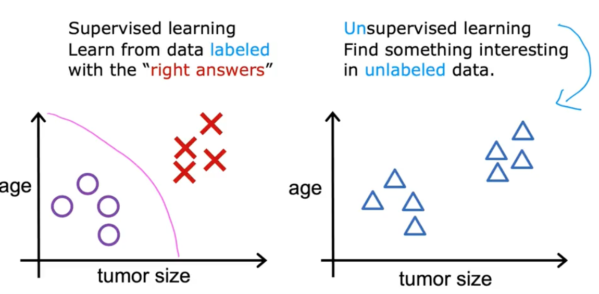
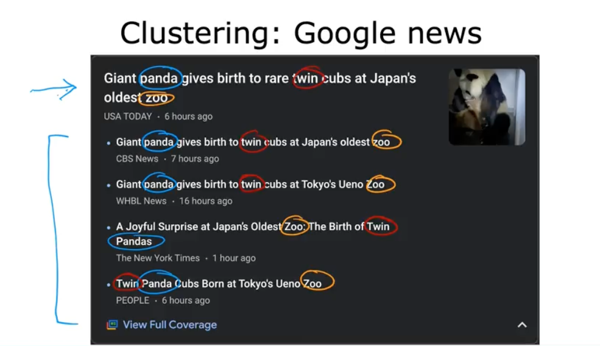

# 📘 Unsupervised Learning

## 🎯 Learning Objectives

- Understand what unsupervised learning is and how it differs fundamentally from supervised learning.

- Explore the concept of clustering, the most common unsupervised learning technique.

- See real-world applications of clustering, including Google News grouping, genetics/DNA analysis, and market segmentation.

- Learn about additional unsupervised learning methods such as anomaly detection and dimensionality reduction (PCA-like tasks).

## 📝 Summary

### 🔍 What Is Unsupervised Learning?

In supervised learning, every training example includes:

(X, Y) → input and a correct label

The algorithm is “supervised” by Y — the right answer.

**In unsupervised learning:**

- The dataset contains only X

- There are no labels Y

- The algorithm must discover structure on its own

**Key idea:**

The algorithm is not told what the output should be. It must find interesting patterns by itself.

This makes unsupervised learning powerful for exploring new datasets where we don’t yet know what patterns to expect.

### 🧩 Clustering: The Most Common Type of Unsupervised Learning

Clustering algorithms group unlabeled data points into clusters — collections of points that are similar to each other.

In the tumor example:

- We have data for age and tumor size

- But no labels such as “benign” or “malignant”

- The algorithm automatically discovers two natural groups

This grouping is not provided by humans — the algorithm discovers it.

### 📰 Real-World Example: Google News Clustering

Every day, Google News scans hundreds of thousands of articles across the internet. It uses clustering to group related articles into the same “story cluster.”

**Why clustering works here:** Articles about the same event often contain similar keywords.

**Why a human cannot manually label everything**

- News topics change every day

- Tens of thousands of new stories appear

- Impossible for a human team to track and label all stories manually

Thus, clustering is essential for grouping similar articles efficiently at scale.

### 🔍 Additional Types of Unsupervised Learning

Beyond clustering, there are two other major families of unsupervised learning covered in this specialization:

#### 1️⃣ Anomaly Detection

Used to find unusual or rare patterns.

**Applications:**

- Financial fraud detection

- Network intrusion detection

- Identifying failures in manufacturing

- Detecting abnormal sensor readings

** Anomalies = data points that don’t fit into the usual patterns.

#### 2️⃣ Dimensionality Reduction

**Used to:**

- Compress large datasets

- Extract core structure

- Remove redundancy

- Simplify data for visualization or learning

** Goal: Reduce data from many dimensions → fewer dimensions
while retaining as much important information as possible.

This is useful when you have data with dozens, hundreds, or thousands of features.

## 📚 References

- [Unsupervised Learning (Wikipedia)](https://en.wikipedia.org/wiki/Unsupervised_learning)

- [Clustering Algorithms Overview](https://scikit-learn.org/stable/modules/clustering.html)

- [K-Means Clustering Explained](https://en.wikipedia.org/wiki/K-means_clustering)

- [Dimensionality Reduction Basics (PCA)](https://scikit-learn.org/stable/modules/decomposition.html#pca)

- [Anomaly Detection Basics](https://www.geeksforgeeks.org/machine-learning/machine-learning-for-anomaly-detection/)