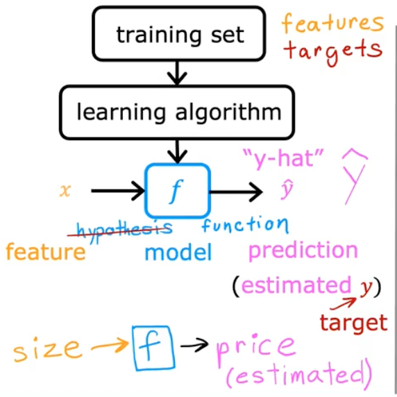
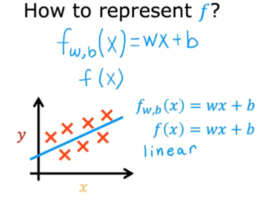

# 📘 Linear Regression — The First Machine Learning Model

## 🎯 Learning Objectives

- Understand the overall supervised learning workflow, from training data to model prediction.
- Learn the key components of a supervised learning system
- Understand what linear regression is and why it is widely used.
- Learn the meaning of features, targets, training examples, and the notation used throughout ML.

## 📝 Summary

### 🔍 What Linear Regression Is

Linear regression is the simplest and most widely used supervised learning algorithm. Its goal is to learn a function that predicts a numerical output based on input data.

Example problem:

> Predict the price of a house from its size.

Dataset example:

- Input feature (x): house size (sq ft)

- Target (y): house price (in $1000s)

Plotting the dataset shows many points (house sales), and the algorithm tries to fit a line that best describes this relationship.

### 🧠 The Supervised Learning Workflow

#### 1. Training set

A dataset containing:

- Features (inputs 𝑥)

- Targets (labels 𝑦)

Example: (x,y)=(2104,400)

→ A house of size 2104 sq ft was sold for $400,000.

#### 2. Learning algorithm

The algorithm receives the training set and learns a function 𝑓 that maps input → output.

#### 3. Model (the function f)

The result of training is a function capable of making predictions: $\hat{y}$ = f(x)

y = actual price (true target)

$\hat{y}$ = model’s estimate (prediction)

#### 4. Prediction stage

Given a new input (e.g., a house size), the model outputs a predicted price.

### 🧱 Machine Learning Notation (Standard Across ML)

Here is the standard notation Andrew Ng uses — and it appears throughout all ML literature:

#### Training examples

- $x^{(i)}$: input feature of the i-th example
- $y^{(i)}$: target feature of the i-th example
- i: row index in the dataset
- m: total number of examples (e.g., 47 houses)

#### Variables

- x = feature

- y = target

- $\hat{y}$  = predicted target

- w = weight (slope)

- b = bias (intercept)

#### Model

$$ f_{w,b}(x^{(i)}) = wx^{(i)} + b \tag{1}$$

This is the formula for univariate linear regression.

### 📈 Representing the Model Function

## 📚 References
- [Linear Regression (Wikipedia)](https://en.wikipedia.org/wiki/Linear_regression)
