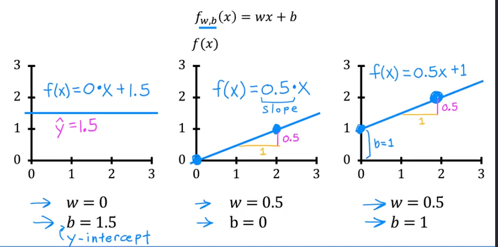
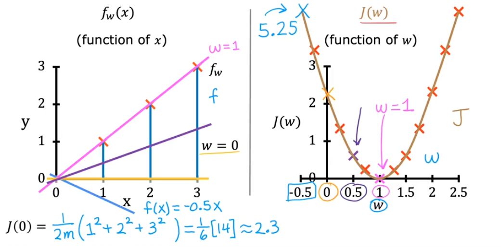
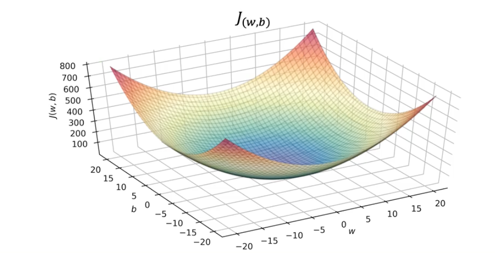
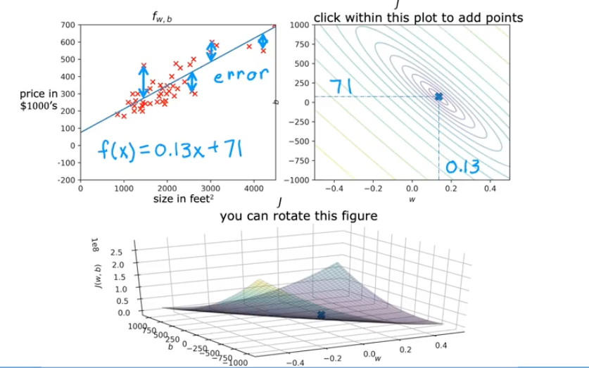

# 📘 Linear Regression — Cost Function

## 🎯 Learning Objectives

- Understand why we need a cost function in linear regression.
- Learn the role of model parameters 𝑤 and 𝑏 and how they affect the prediction line.
- Define the **mean squared error cost function** J(w,b) formally.
- Visualize the cost function as a curve in 1D and a surface in 2D.

## 📝 Summary

### 🔍 What is the Cost Function

#### 1. Parameters and the Need for a Cost Function

In linear regression we use the model:

$$ f_{w,b}(x) = wx + b $$

- x → input feature (e.g., house size)
- $\hat{y}$ = $f_{w,b}(x)$ → predicted output (estimated price)
- w,b → parameters of the model (also called weights or coefficients)

Different choices of 𝑤 and 𝑏 give different straight lines:

**Our goal:** Choose 𝑤 and 𝑏 so that the line fits the training data well.

But how do we measure “fits well”?
That’s exactly the job of the cost function.

#### 2. Measuring Error for a Single Example

For one training example: $(x^{(i)}, y^{(i)})$

$\hat{y}$ = $f_{w,b}(x^{(i)}) = wx^{(i)} + b$

The **error** is:

$error^{(i)} =$ $\hat{y}$ $ - y^{(i)}$

To avoid negatives canceling positives and to penalize big mistakes more, we use the **squared error**:

$($ $\hat{y}$ $- y^{(i)})^2$

#### 3. Cost Over the Dataset

For a training set with 𝑚 examples, we sum the squared errors over all examples. To make this quantity independent of dataset size, we take the average, giving the **mean squared error cost function**: 

By convention, we also multiply by $1/2$ (this makes derivatives simpler later).

So:

- Input to 𝐽: parameters 𝑤,𝑏

- Output of 𝐽: how bad the model is (mean squared error)

Training linear regression = finding 𝑤,𝑏 that make 𝐽(𝑤,𝑏) as small as possible.

#### 4. Cost Function Intuition with a Toy Example

To build intuition, Andrew uses a tiny dataset: $(1,1),(2,2),(3,3)$
and a simplified model with no bias $(b=0)$:

$$ f_{w,b}(x) = wx $$

Now the cost is just $J(w)$ (a function of a single parameter).

Plotting all these $J(w)$ values gives a U-shaped curve:

- The bottom of the U (minimum cost) is at $w = 1$
- That parameter choice gives the best fit for this dataset.

#### 5. The 2D Cost Surface $J(w,b)$

When we bring back both parameters w and b, J becomes a function of these two variables. We can visualize it as a **surface** in 3D:

- Horizontal axes: w and b
- Vertical axis: $J(w,b)$

The surface looks like a bowl / hammock / curved plate:
- Each point $(w,b)$ on the floor plane has a corresponding height $J(w,b)$.

- The lowest point on the surface is the optimal $(w, b)$ — the best-fitting line.

## 📚 References
- [Mean Squared Error (MSE) — Wikipedia](https://en.wikipedia.org/wiki/Mean_squared_error)

- [Cost Functions in Machine Learning](https://developers.google.com/machine-learning/crash-course/linear-regression/gradient-descent)

- [Visualizing Loss Surfaces](https://developers.google.com/machine-learning/crash-course/linear-regression/gradient-descent)