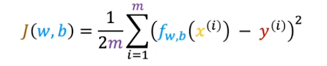
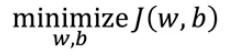
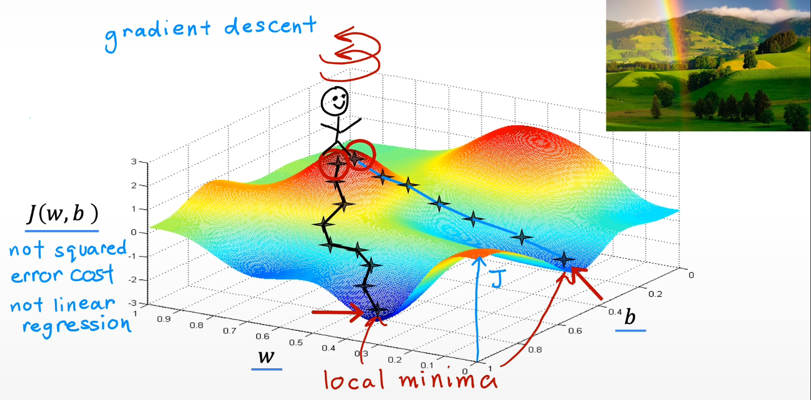
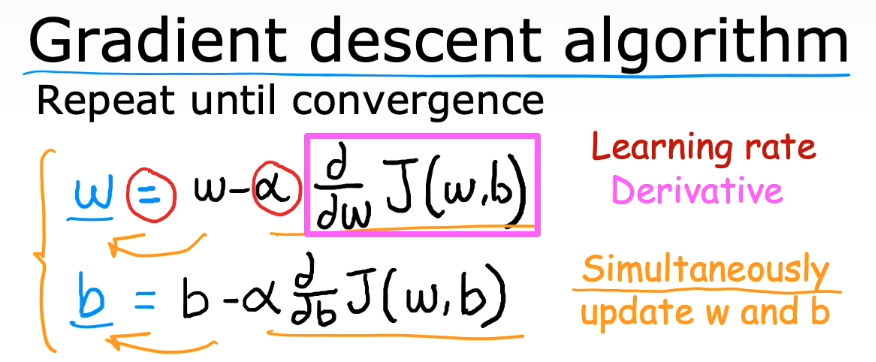
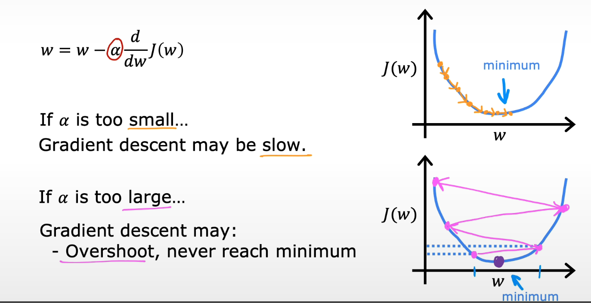
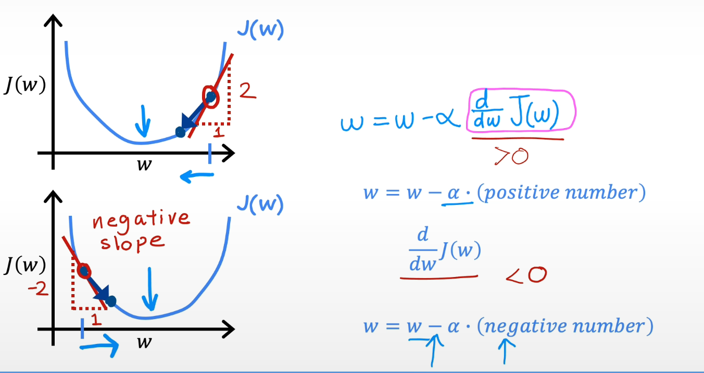
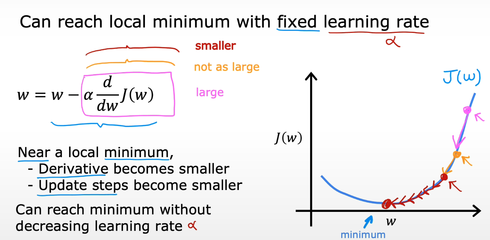
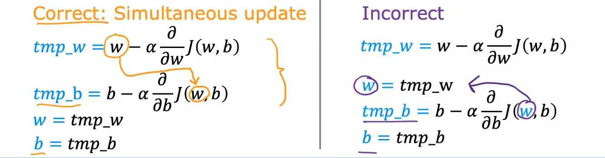
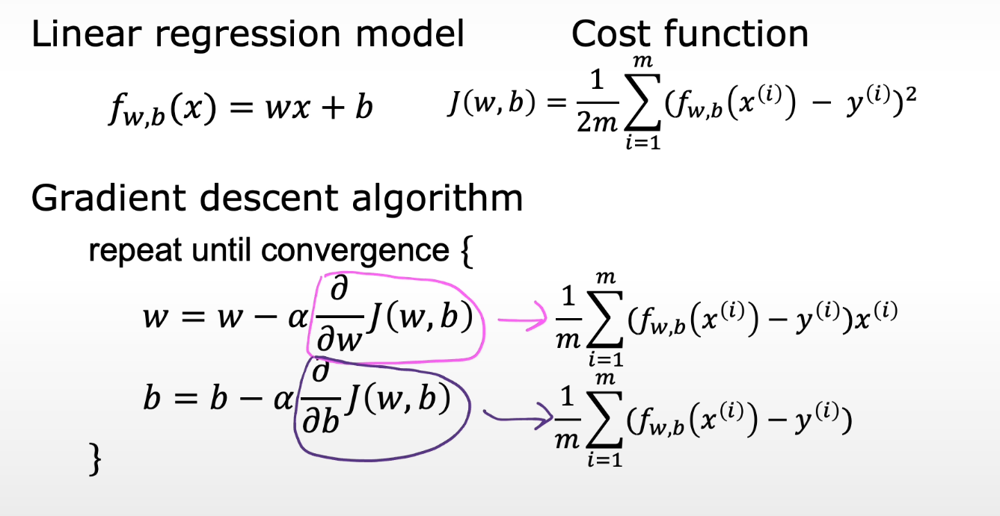

# 📘 Gradient Descent for Linear Regression

## 🎯 Learning Objectives

- Understand why we need an optimization algorithm after defining the cost function.
- Learn what gradient descent is and how it is used to minimize the cost function $J(w,b)$ .
- Understand the update rule for parameters $w$ and $𝑏$ and the meaning of Learning rate and derivative / gradient

## 📝 Summary

### 1. From Cost Function to Optimization Problem

Previously, we defined the squared error cost function for linear regression:

Training linear regression now becomes an optimization problem:

We want a systematic way to choose $w$ and $𝑏$ that make the cost as small as possible. Trying random values is inefficient, so we introduce **gradient descent.**

### 2. Intuition: Walking Downhill on the Cost Surface

Think of the cost function as a landscape:

- Horizontal axes: parameters $w$ and $b$
- Vertical axis: cost $J(w,b)$

For linear regression this surface is a smooth bowl/hammock, but in more complex models (e.g., neural networks) it can be very wavy with many hills and valleys.

Imagine you are standing on this surface at some initial point $(w,b)$ and your goal is walk downhill to reach a valley (a minimum of $J$).

At each step you:

1. Look around in all directions.

2. Find the direction where the cost decreases most rapidly (steepest descent).

3. Take a small step in that direction.

Repeating this process moves you down the surface until you reach a local minimum.

> On a convex bowl (like linear regression), any valley you reach is also the global minimum.
On more complex surfaces (e.g., deep networks), different starting points can lead to different local minima.

### 3. Gradient Descent Algorithm (General Form)

For parameters $w$ and $b$ , gradient descent repeats the following updates until convergence:

Key ideas:

- The gradient tells you the direction of steepest increase of $J$.

- Multiplying by $−𝛼$ flips direction (to go downhill) and scales step size.

### 4. Learning Rate $α$: Step Size

- $α > 0$, usually a small number (e.g., 0.01, 0.001).

- Controls how big each update step is:

  - Too small → progress is very slow (tiny baby steps).

    - Too large → you may “overshoot” the valley and bounce around or diverge.

Choosing a good $α$ is crucial in practice and is usually done by experimentation.

### 5. The Role of the Derivative (1D Intuition)

To build intuition, consider a simplified case with one parameter $w$ and cost $J(w)$ (we set $b = 0$).

Gradient descent becomes:

At some point on the curve:

- Draw the tangent line.
- The slope of that line is the derivative

Gradient descent always moves $w$ in the direction that reduces $J(w)$, because it steps opposite to the **sign of the derivative.**

Repeated updates gradually move $w$ w toward the point where the slope is zero → minimum of  $J(w)$.

### 6. Simultaneous Update of $w$ and $b$

When updating both parameters, we must use the old values of $w$ and $b$ to compute both gradients before updating either parameter.

### 7. Gradient Descent for Linear Regression (Concrete Form)

Using basic calculus rules (chain rule & derivative of a square), we obtain the derivates of the cost function $J(w,b)$.

Plugging the formulas into the gradiente descent rules we get the concrete form of the algorithm for linear regression.

## 📚 References

- [Gradient Descent — Wikipedia](https://en.wikipedia.org/wiki/Gradient_descent)

- [Linear regression: Hyperparameters](https://developers.google.com/machine-learning/crash-course/linear-regression/hyperparameters)

- [Visualizing Loss Surfaces](https://developers.google.com/machine-learning/crash-course/linear-regression/gradient-descent)
