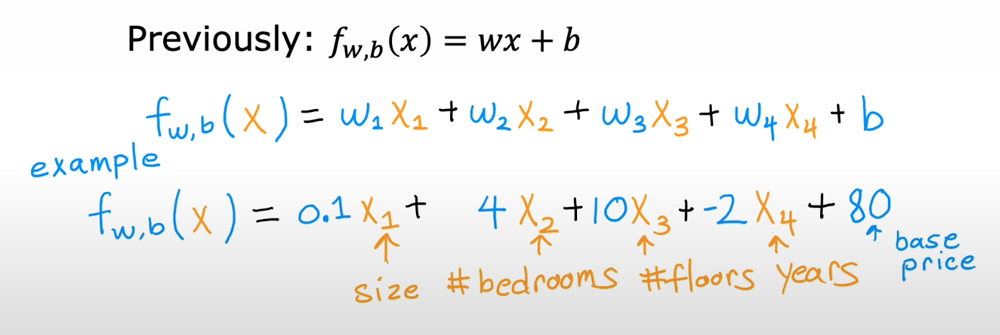
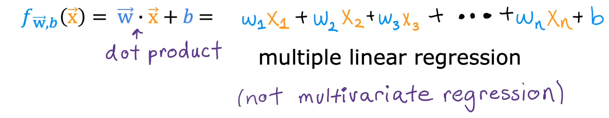

# 📘 Multiple Features in Linear Regression

## 🎯 Learning Objectives

- Extend linear regression from one feature to many features (size, bedrooms, floors, age, etc.).
- Learn the notation for: individual features, feature vectors, number of features, etc.
- Rewrite the model compactly using vector notation and the dot product.

## 📝 Summary

### 1. From One Feature to Many

Previously, linear regression used a single feature $x$ (e.g., size in square feet) to predict the house price $y$:

$$f_{w,b}(x) = wx + b$$

But in reality, housing price depends on more than just size. We can use a richer dataset where each house has several attributes (features):

- $x_{1}$: size in $feet^{2}$
- $x_{2}$: number of bedrooms
- $x_{3}$: number of floors
- $x_{4}$: age of the home in years

More features → more information → a model that can **potentially** make better predictions.

### 2. Notation for Multiple Features

We now need a systematic way to refer to all these features and training examples.

### 3. Multiple Linear Regression Model (Many Features)

With multiple features, the model becomes a weighted sum of all features plus a bias:

So each $w_{j}$ tells you how sensitive the price is to that feature, holding others fixed.

### 4. Vector Notation and Dot Product

To write the model more compactly, we use vectors:

This compact form:

- Makes the math cleaner.

- Matches how we’ll implement things in code (e.g., NumPy vector operations).

- Generalizes nicely when $n$ becomes large (dozens, hundreds, or thousands of features).

## 📚 References

- [Linear Regression - Stanford CS229](https://see.stanford.edu/materials/aimlcs229/cs229-notes1.pdf)

- [Dot Product (Linear Algebra)](https://en.wikipedia.org/wiki/Dot_product)
